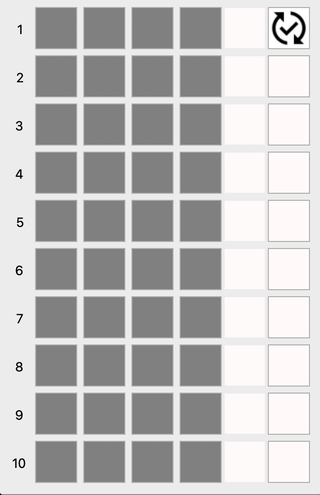
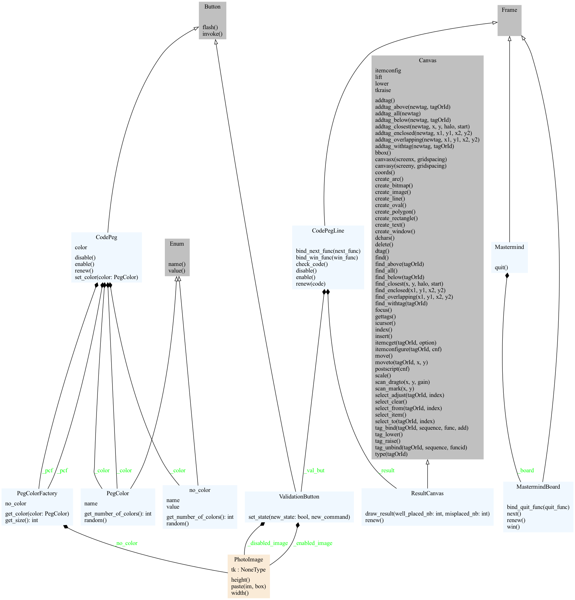

# Mastermind


Minimalist Mastermind written in Python with TK GUI.

## Table of Contents

  - [Presentation](#presentation)
  - [Installation](#installation)
  - [Instructions for use](#instructions-for-use)
  - [Class diagram](#class-diagram)


## Presentation

Here's what this minimalist graphical interface looks like:



Mastermind was invented in 1970 by Mordecai Meirowitz, in Israeli.
The rules can be found here: [wikipedia](https://en.wikipedia.org/wiki/Mastermind_(board_game)).

There are many variants, mainly designed to make the game more complex. This implementation follows original rules, i.e. 6 colors and 4 holes.

## Installation

> [!WARNING]
> This code works with Python 3.11 but not with Python 3.9.
> I haven't tested any other versions of Python...

Nothing fancy here :wink:

Clone this repository:
```bash
git clone https://github.com/be-next/mastermind.git
```

Install prerequisites:

```bash
$> pip install -r requirements.txt
```

Set the execution flag:
```bash
$> chmod u+x mastermind.py
```

Then simply launch the application:
```bash
$> ./mastermind.py
```

## Instructions for use

Only one line is active, starting with the first.

At the start, click on the grey square to select colors. 
Each time you click, the color changes.
The colors are arranged in the following order: blue, green, orange, pink, violet and red.
Once all the holes are colored, click on the right-hand button to check the solution.

The result is coded by black and white circles:
  - A white circle means that a color is the correct one, but has not been placed at the right place,
  - A black circle means that one of the colors is correct and in the right place,
  - no circle means that one of the colors is not part of the solution.

The order of the results is not linked to the order of the holes.

> [!TIP]
> 4 black circles and you're in!


## Class diagram

Just to test, see and share what this type of tool can do, here's the class diagram generated by ```pyreverse```.

The command line is as follows:

```bash
$> pyreverse --colorized -o png -p mastermind -a 1 -s 1 ./mastermind.py
```

This is the class diagram :


